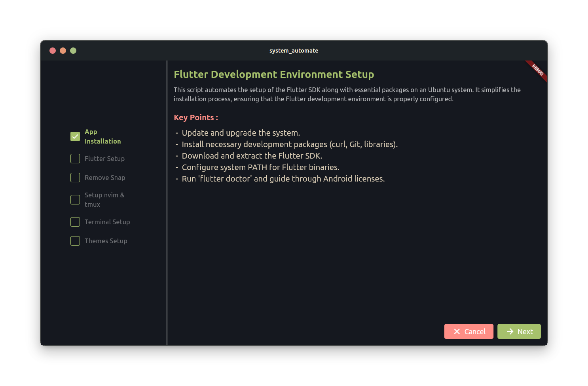

# Ubuntu Development Environment Setup

This project automates the setup of a complete development environment on Ubuntu. It simplifies the installation of essential packages, DEB files, Flatpak applications, and custom configurations using a series of shell scripts.



## Key Features

- **Automated Installation:** Easily set up your development environment with scripts that handle everything from system updates to package installations.
- **Flutter Setup:** Install the Flutter SDK and essential packages with one script, ensuring your Flutter environment is ready to go.
- **Snap Removal:** Remove the Snap package manager and replace it with Flatpak for a more streamlined system.
- **Tmux & Neovim Setup:** Configure Tmux and Neovim with custom configurations to enhance your development workflow.
- **Zsh and Powerlevel10k:** Set up Zsh with the Powerlevel10k theme, providing a powerful and aesthetically pleasing terminal experience.
- **GTK Theme and Icon Setup:** Customize your Ubuntu desktop with a consistent and beautiful theme across all applications, including Flatpak apps.

## Scripts Overview

1. **App Installation:**
   - Installs essential packages, DEB files, and Flatpak applications.
   - Sets up Node.js and handles other vital packages.
   - [Learn more](scripts/app_install.sh)

2. **Flutter Setup:**
   - Installs the Flutter SDK and development dependencies.
   - Configures the system for Flutter development.
   - [Learn more](scripts/flutter.sh)

3. **Remove Snap:**
   - Purges Snap and replaces it with Flatpak.
   - Reinstalls popular applications using alternative methods.
   - [Learn more](scripts/remove_snap.sh)

4. **Setup nvim & tmux:**
   - Configures Tmux and Neovim with custom settings.
   - [Learn more](scripts/setup_nvim_tmux.sh)

5. **Terminal Setup:**
   - Installs Zsh, Powerlevel10k theme, and necessary fonts.
   - Configures the terminal environment.
   - [Learn more](scripts/terminal_zsh.sh)

6. **Themes Setup:**
   - Installs a custom GTK theme and icon set.
   - Configures Flatpak applications to match the system theme.
   - [Learn more](scripts/themes.sh)

## How to Use


1. **Download the `.deb` file** from the [Releases](https://github.com/your-username/your-repo-name/releases) section of this repository.

2. **Install the `.deb` file** by running the following command:
   ```bash
   sudo dpkg -i your-app-name.deb